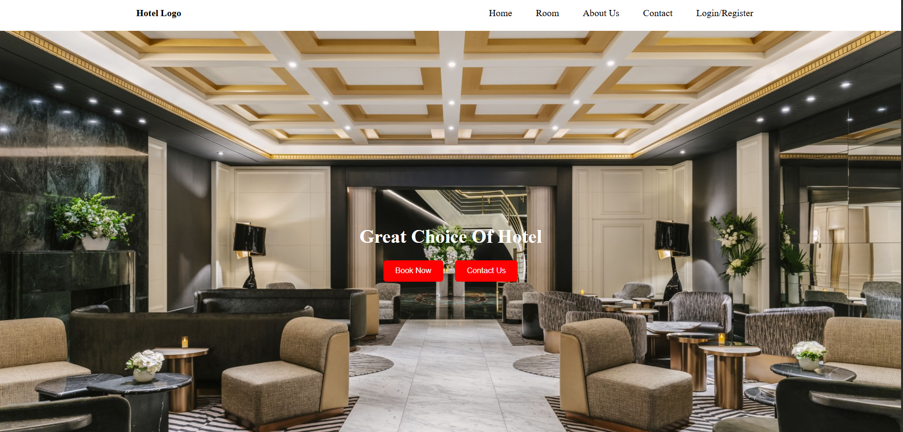
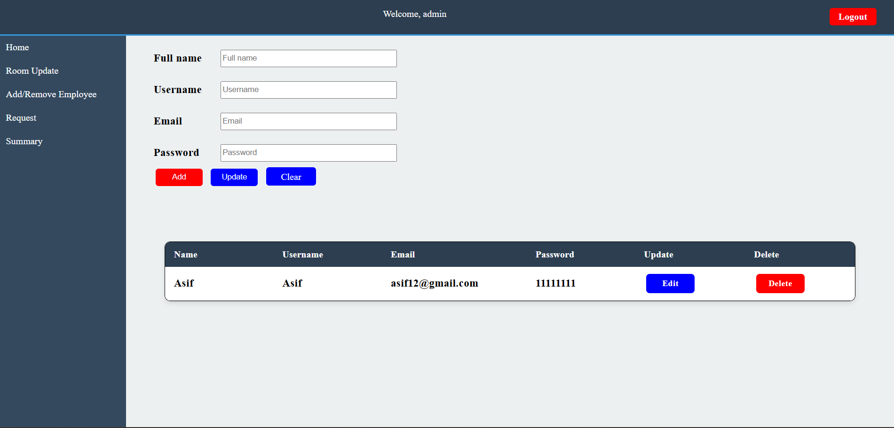
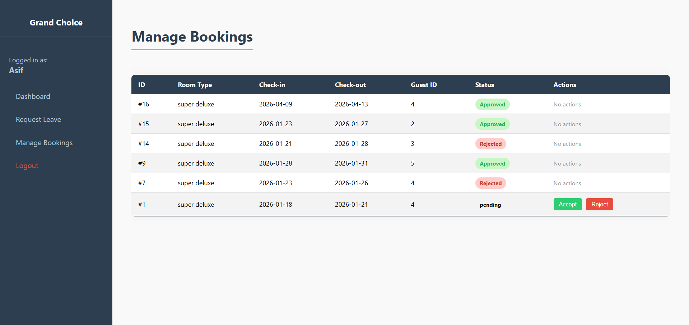
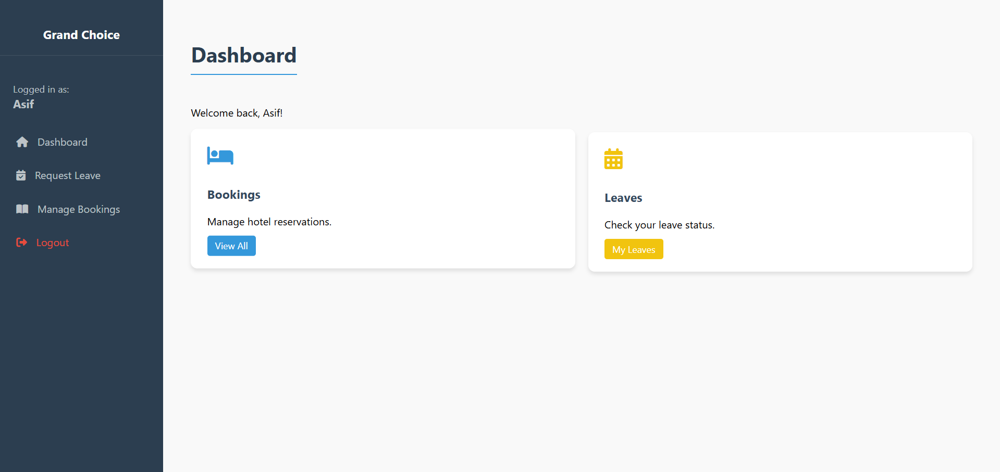
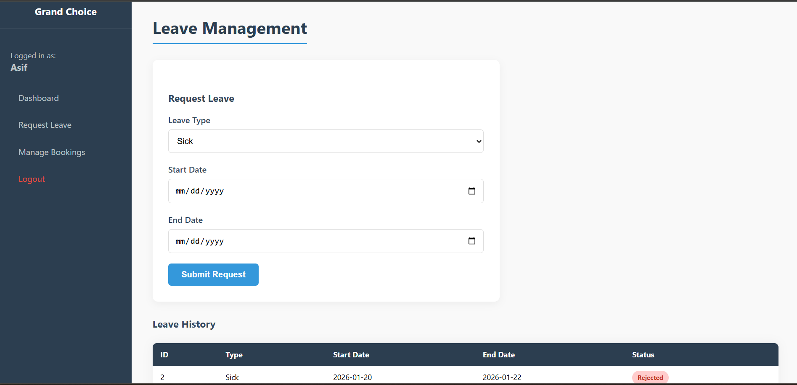
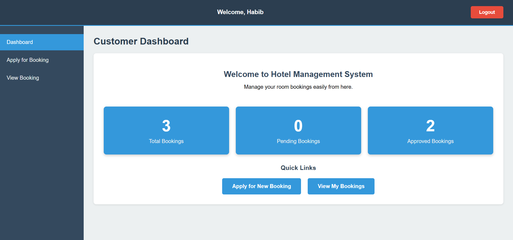
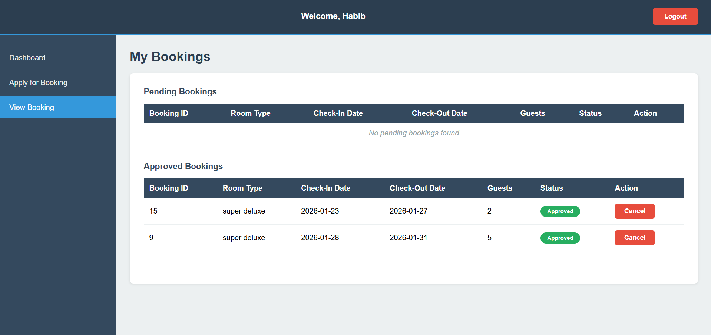

# 🏨 Grand Choice Hotel — Hotel Management System

A full-stack web application for managing hotel operations, built with PHP, MySQL, HTML, CSS, and JavaScript. The system supports three distinct user roles — **Admin**, **Employee**, and **Customer** — each with a dedicated dashboard and feature set.

---

## 📋 Table of Contents

- [Features](#features)
- [Tech Stack](#tech-stack)
- [Project Structure](#project-structure)
- [Getting Started](#getting-started)
- [User Roles](#user-roles)
- [Database](#database)
- [Visuals](#visuals)
- [Demo Video](#demo-video)
- [License](#license)

---

## ✨ Features

### 🛡️ Admin
- Dashboard with live stats: total booked rooms, total staff, and per-room-type availability
- Add and remove employees
- Update room information and pricing
- Review and manage employee leave/booking requests
- View booking summary reports

### 👔 Employee
- Personal dashboard with assigned tasks
- View hotel bookings
- Apply for leave and track leave status
- Submit requests to management

### 🧳 Customer
- Browse available rooms with pricing on a public landing page
- Register and log in securely
- Book rooms with date selection
- View and cancel existing bookings

### General
- Role-based authentication with PHP sessions
- Page-level security (unauthorized access redirected)
- Password recovery flow
- Responsive UI with custom CSS per role

---

## 🛠️ Tech Stack

| Layer      | Technology                        |
|------------|-----------------------------------|
| Backend    | PHP (MVC-style architecture)      |
| Database   | MySQL via `mysqli`                |
| Frontend   | HTML5, CSS3, JavaScript (Vanilla) |
| Icons      | Font Awesome 6.5                  |
| Server     | Apache / XAMPP (local)            |

---

## 📁 Project Structure

```
Web-Technologies-Project/
├── controllers/          # Business logic & request handling
│   ├── login_controller.php
│   ├── reg_controller.php
│   ├── addEmployeeController.php
│   ├── customerAddBookingController.php
│   ├── customerCancelBookingController.php
│   ├── leave_controller.php
│   └── ...
├── model/                # Database queries
│   ├── connection.php
│   ├── login_query.php
│   ├── reg_query.php
│   ├── customerBookingAddQuery.php
│   ├── employeeAddQuery.php
│   └── ...
└── views/                # UI pages
    ├── front.php               # Public landing page
    ├── log_reg.php             # Login / Register
    ├── admin_dashboard.php
    ├── employee_dashboard.php
    ├── customer_dashboard.php
    ├── customerBookingAdd.php
    ├── customerBookingView.php
    ├── employeeadd.php
    ├── roomupdate.php
    ├── summary.php
    ├── leave.php
    ├── css/                    # Role-specific stylesheets
    ├── js/                     # Client-side scripts
    └── images/                 # Room & hotel images
```

---

## 🚀 Getting Started

### Prerequisites
- [XAMPP](https://www.apachefriends.org/) (or any Apache + PHP + MySQL stack)
- PHP 7.4+
- MySQL 5.7+

### Installation

1. **Clone the repository**
   ```bash
   git clone https://github.com/your-username/Web-Technologies-Project.git
   ```

2. **Move to your server's web root**
   ```bash
   # For XAMPP on Windows
   mv Web-Technologies-Project C:/xampp/htdocs/

   # For XAMPP on Linux/macOS
   mv Web-Technologies-Project /opt/lampp/htdocs/
   ```

3. **Set up the database**
   - Open [phpMyAdmin](http://localhost/phpmyadmin)
   - Create a new database named `hotel_management`
   - Import the provided SQL file (if included), or create the tables manually based on the query files

4. **Configure the database connection**

   Open `model/connection.php` and update credentials if needed:
   ```php
   $hostName = "localhost";
   $username = "root";
   $password = "";
   $dbName   = "hotel_management";
   ```

5. **Run the application**

   Visit: `http://localhost/Web-Technologies-Project/views/front.php`

---

## 👥 User Roles

| Role     | Default Entry Point          | Access                                      |
|----------|------------------------------|---------------------------------------------|
| Admin    | `views/admin_dashboard.php`  | Full system control                         |
| Employee | `views/employee_dashboard.php` | Bookings, leave management, requests      |
| Customer | `views/customer_dashboard.php` | Room browsing, booking, cancellations    |

Roles are assigned in the `user` table and enforced via PHP session checks on every protected page.

---

## 🗄️ Database

The application connects to a MySQL database named `hotel_management`. Key tables include:

- `user` — stores all users with `name`, `uname`, `email`, `pwd`, and `role` (`admin`, `employee`, `user`)
- `room` — room details including `room_type`, `price`, and availability
- `booking` — customer reservations with dates and status
- `leave` — employee leave applications with type, start/end dates, and approval status

---

## 🖼️ Visuals

### 🌐 Landing Page


### 🛡️ Admin — Add Employee


### 🛡️ Admin — Manage Bookings


### 👔 Employee Dashboard


### 👔 Employee — Leave Management


### 🧳 Customer Dashboard


### 🧳 Customer — View Bookings


---

## 🎬 Demo Video

Watch the full project walkthrough on YouTube:

[](https://www.youtube.com/watch?v=bLJx0nqzx9o&t=166s)


## 📄 License

This project was developed as a Web Technologies course project. Feel free to use it for educational purposes.
